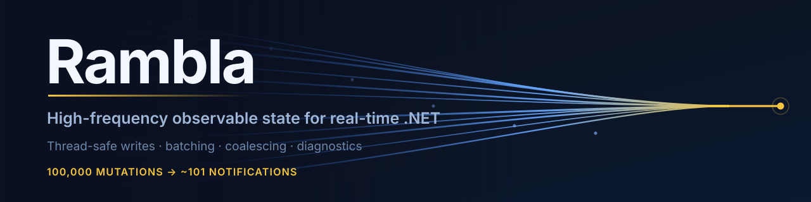

<p align="center">
  
</p>

# Rambla

[](https://github.com/nicoseijas/Rambla/actions/workflows/ci.yml)
[](https://www.nuget.org/packages/Rambla)
[](https://www.nuget.org/packages/Rambla)
[](./LICENSE)
[](https://github.com/nicoseijas/Rambla)

Rambla is an observable-state layer for .NET desktop apps whose state changes
faster than the UI can render it: trading terminals, telemetry and monitoring
dashboards, poker tables, device status, anything driven by a WebSocket feed.
You write state from any thread; Rambla coalesces the intermediate values and
posts one batched notification per UI flush.

It is named after the Uruguayan *rambla* — many parallel flows moving
continuously along a shared surface.

---

## The cost of the background → UI boundary

WPF and other XAML frameworks have thread affinity around a single UI
`Dispatcher`. That thread processes input, layout and rendering. When a feed
pushes updates at high frequency, the naive path looks like this:

```
WebSocket / worker / timer
        ↓  2,000 updates/sec
ViewModel
        ↓
PropertyChanged × N
ObservableCollection change × N
Dispatcher.Invoke × N
        ↓
UI thread saturated
```

The problem is **not** `INotifyPropertyChanged`. The problem is emitting tens of
thousands of notifications the UI cannot possibly render, one dispatcher hop at
a time.

## Separating mutation from notification

Rambla splits *state mutation* from *UI notification*. You write from any
thread; Rambla decides when and how the UI is told.

```csharp
public partial class MarketViewModel : RamblaState
{
    [State] private decimal _bid;   // generates an observable `Bid` property
    [State] private decimal _ask;   // → `Ask`
    [State] private decimal _pnl;   // → `PnL`
}
```

You annotate the backing field; the generator emits the observable property
(stripping the leading underscore, `_bid` → `Bid`) and routes its setter through
Rambla's batching and coalescing.

From any background worker:

```csharp
vm.Bid = 1.2345m;
vm.Ask = 1.2346m;
vm.PnL = 23m;
```

No `Dispatcher.Invoke`, no `OnPropertyChanged(...)`, no
`SynchronizationContext.Post(...)`. Instead of `4 dispatcher calls →
4 PropertyChanged → 4 binding passes`, the runtime does:

```
worker writes → dirty state → coalesce → UI flush (~16 ms) → batched notification
```

The work that *fetches* the state gets the same treatment. Annotate an async
method and the generator emits the command plus the state that describes its run:

```csharp
public partial class SearchViewModel : RamblaState
{
    // → SearchCommand, IsSearching, SearchError, CancelSearchCommand
    [StateCommand(CancelPrevious = true)]
    private async Task SearchAsync(CancellationToken token)
        => Results = await _api.SearchAsync(Query, token);
}
```

`CancelPrevious` is latest-wins: each keystroke cancels the request it replaces.
Failures land in `SearchError` instead of crashing an `async void` handler, and
cancelling is not a failure. Bind the button to `SearchCommand` — it disables
itself while the run is in flight.

## What ships today

- **Coalescing** — latest value wins. A price that ticks five times in 5 ms
  notifies the UI once, with the final value.
- **Explicit batching** — coalesce writes into one *coherent notification pass*:
  bindings are never notified mid-batch, so the UI re-renders on the batch's
  final values together, not on a half-applied `Bid`/stale `Ask`. (This is
  notification coherence, not cross-thread state atomicity — use snapshots for
  that.)
- **`[State]` source generator** — annotate a backing field, get an observable
  property routed through the batching/coalescing engine.
- **`[StateCommand]` async commands** — annotate an async method, get an
  `AsyncStateCommand` plus the state that describes its run: busy flag, last
  error, and a cancel command. Opt into latest-wins with `CancelPrevious = true`.
- **Framework-neutral scheduling** — the core never references `Dispatcher`;
  integration is an `IStateScheduler` adapter (WPF, Avalonia, and WinUI 3 ship
  today).
- **Bounded refresh rate** — wrap any scheduler in `ThrottlingStateScheduler` (or
  call `DispatcherStateScheduler.InstallThrottledAsDefault()`) and flushes reach
  the UI at most `MaxRefreshRate` times a second, no matter how fast the feed
  writes. The first update after an idle period still goes through immediately.
- **Opt-in metrics** — turn on lifetime counters (`Metrics`) to see how many
  mutations coalesced away.
- **High-frequency collections** — `RamblaList<T>` and `RamblaDictionary<K,V>`
  accept writes from any thread and coalesce a burst into the minimum
  `CollectionChanged` events per flush (`Batch`, `ReplaceSnapshot` with a minimal
  diff; latest-value-wins per key), instead of one per item.

## Designed, not yet shipped

See [ROADMAP.md](./ROADMAP.md).

- **Snapshots** — publish an immutable scalar-state snapshot as a single
  consistent unit; the cross-thread state-atomicity path. *(For collections,
  `RamblaList<T>.ReplaceSnapshot` ships today.)*
- **Per-property frequency policy** — a refresh rate chosen per property
  (`[State(UpdateRate = 10)]`) rather than per scheduler. *(The scheduler-wide
  ceiling, `MaxRefreshRate`, ships today.)*
- **Priorities** — a framework-neutral abstraction over dispatcher priority
  levels, so real-time data outranks background text.

## Diagnostics

Attach a session to any state (it's a pure observer — zero behaviour change) and
poll it. It reports mutation and notification rates, coalescing ratio, hot
properties, dispatcher latency and the resulting UI-thread budget:

```csharp
using var session = StateDiagnostics.Attach(viewModel);
Console.WriteLine(session.Snapshot());   // e.g. once a second
```

```
MarketViewModel
  Incoming state mutations  :   18,420 / sec
  UI notifications          :       58 / sec
  Coalescing                :   99.68 %
  Dispatcher hops           :       60 / sec
  Longest UI flush          :   2.8 ms
  UI thread budget          :     17 %

  ⚠ 'Positions' generated 14,281 notifications/sec. Recommendation: batch related
    writes with BeginUpdate(), or for a collection use Batch()/ReplaceSnapshot().
```

Dispatcher latency, hops and an accurate UI-thread budget come from wrapping your
scheduler with `DiagnosticsScheduler`; without it those lines are omitted and the
rest is derived from notification-raise time. For a lighter footprint, the core
also exposes lifetime coalescing counters via the opt-in `Metrics` property
([BENCHMARKS.md](./BENCHMARKS.md) shows them in use).

## What Rambla does not replace

- **CommunityToolkit.Mvvm** — keep using it for `ObservableObject`,
  observable-property generation and `RelayCommand`/`AsyncRelayCommand`.
- **ReactiveUI** — keep it for reactive composition and schedulers.
- **DynamicData** — keep it for `IChangeSet<T>` reactive collection queries.

Rambla owns one narrower job: the background → UI boundary under sustained load.
If your state changes at UI speed, you do not need it.

## Packages

| Package             | Purpose                                        |
| ------------------- | ---------------------------------------------- |
| `Rambla`            | Framework-agnostic core state engine           |
| `Rambla.Diagnostics`| Live diagnostics (`StateDiagnostics.Attach`)   |
| `Rambla.Wpf`        | WPF dispatcher scheduler adapter               |
| `Rambla.Avalonia`   | Avalonia dispatcher scheduler adapter          |
| `Rambla.WinUI`      | WinUI 3 `DispatcherQueue` scheduler adapter    |

The core never references `Dispatcher`. Framework integration is an adapter
behind `IStateScheduler`.

## Benchmark

Indicative result at 100,000 writes with a UI-like subscriber (convert +
fan-out), from [BENCHMARKS.md](./BENCHMARKS.md):

| Path             | Notifications | Mean       | Allocated |
| ---------------- | ------------: | ---------: | --------: |
| Naive            |       100,000 | ~11.0 ms   | 21,871 KB |
| Rambla coalesced |         ~101  | ~1.0 ms    |     32 KB |

Same producer load. The gap comes from the notification count, not from a faster
notification: 100,000 mutations reach the subscriber as ~101 notifications, so
the downstream work is never emitted.

Two cases where that does not hold. With a no-op subscriber the naive path wins
on raw CPU — Rambla adds bookkeeping and there is no downstream work to save.
With a high-entropy stream — thousands of *distinct* properties per flush —
there is nothing to coalesce, and Rambla loses. It is a tool for state that
repeats faster than it renders, not for one-shot fan-outs. See
[BENCHMARKS.md](./BENCHMARKS.md) and [docs/philosophy.md](./docs/philosophy.md).

Run the [WPF market dashboard demo](./samples/Rambla.Demo.MarketDashboard) or
the [WinUI 3 market dashboard demo](./samples/Rambla.Demo.WinUI) to watch it
live.

## Status

Early. The core state engine (writes, batching, coalescing, schedulers, opt-in
metrics) is implemented, its V1 semantics are frozen
([SEMANTICS.md](./SEMANTICS.md)), and it is covered by unit and concurrency
stress tests. The WPF, Avalonia, and WinUI 3 adapters run. The repository has
real-time market dashboard demos for both WPF and WinUI 3.
The `[State]` and `[StateCommand]` source generators ship and are dogfooded by
the demo. `RamblaList<T>`, `RamblaDictionary<K,V>`, `Rambla.Diagnostics`, the
throttling scheduler and async state commands are shipped.

There is no external production usage yet that I know of, so treat the API as
settled in semantics but young in mileage. Next up is the remaining framework
adapters ([ROADMAP.md](./ROADMAP.md)); the thesis is in [VISION.md](./VISION.md)
and contributors should read [GUIDELINES.md](./GUIDELINES.md) first.

## License

MIT — see [LICENSE](./LICENSE).

## Language

English is the primary language of this project (code, docs, issues, and
discussions) to keep the international community inclusive.

---

<p align="center">
  <br>
  <sub>Built in Montevideo, Uruguay</sub>
</p>
